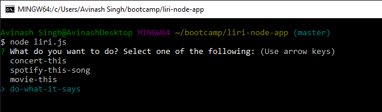
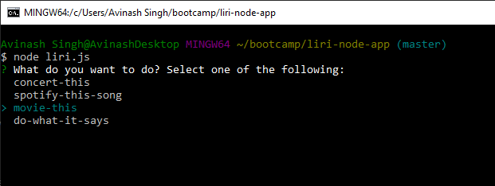
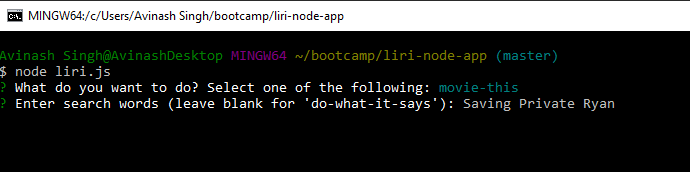

# LIRI Bot

### Problem
This app accepts user input to choose out off 1 of the 4 search types it can perform and also allows the user to input the search terms.

### Brief Description
The app can seach and display results for songs/tracks, movies and artists/events. Depending on the user selection and search term the result/s are displayed on the terminal window.

### Instructions to Use
    * Start the app by navigating to it's location folder and typing "node liri.js".
    * Select one of the four options using your arrow keys (default is "do-what-it-says") and pressing the "Enter" key.
    * Enter the search term related to the selected option and press the "Enter" key.
    * NOTE: Option 4, "do-what-it-says" does not require a search term. Just press the "Enter" key if you selected this option.
    * If the app finds results related to your search it will display them on the console/terminal window.

### Images

